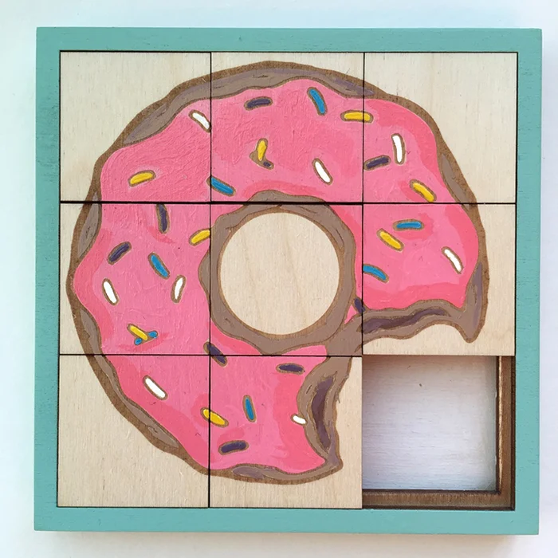

# Sliding puzzle

A sliding puzzle, sliding block puzzle, or sliding tile puzzle is a combination puzzle that challenges a player to slide (frequently flat) pieces along certain routes (usually on a board) to establish a certain end-configuration.

[Demo](https://ingadi.github.io/sliding-tiles-puzzle/)
